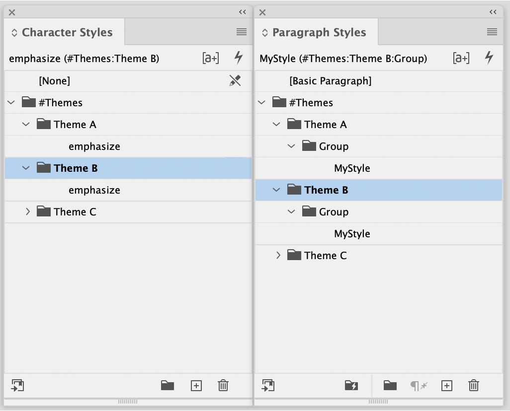
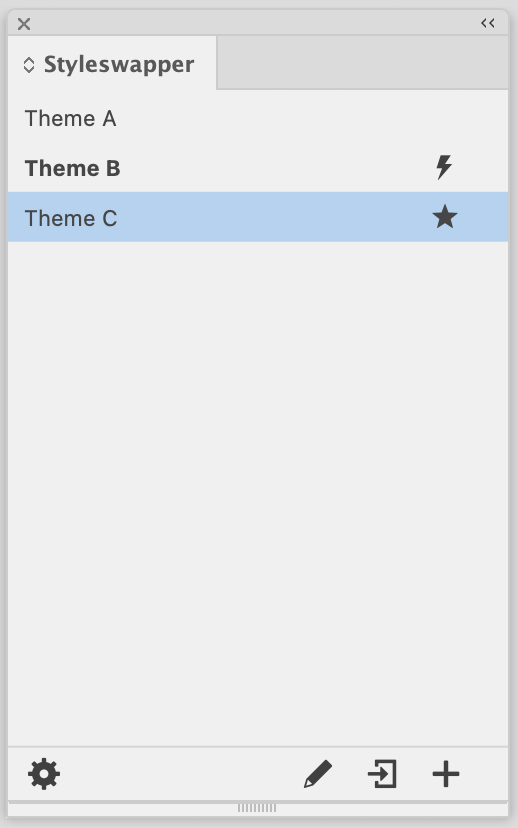
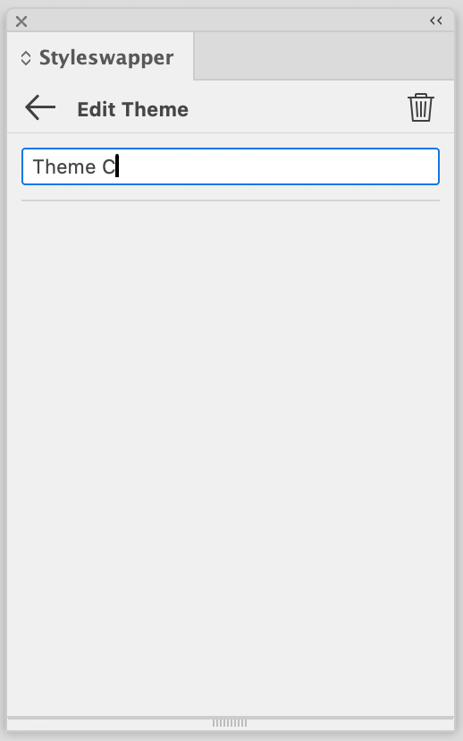
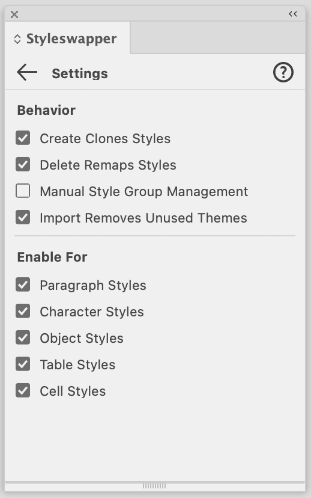

# Rxcle Styleswapper

Styleswapper is a productivity plugin for Adobe InDesign that enables you to create and quickly switch between design "themes" using text and object styles in your document. Themes can consist of any number and combinations of Paragraph, Character, Object, Table and Cell styles. These styles are created and managed using the familiar panels in InDesign. 

## Getting started

This tutorial will walk you through creating and using your first themes with Styleswapper. It is _highly_ recommended starting with this if you're new to Styleswapper. It is assumed here that the Styleswapper settings are set to their factory default values, refer to chapter [Settings](#settings) for more info.

### Create a theme

1. Create a new document or open an existing one in InDesign.
2. Open the Styleswapper plugin panel via the `Plug-ins` `>` `Styleswapper` menu.
3. Press the `Create Theme` button in bottom right of the panel:  
4. You can now choose a name for the theme or accept the default one, e.g. `Theme 1`
   - This name has to be unique for the current document and cannot be empty
   - You can change this name later on
5. Confirm the creation of the theme by either pressing the Enter key if the name input has focus or by pressing the `Back` button: 
6. The theme has now been created as part of the current document and shows up in the Styleswapper panel
   - Changes to themes are only persisted across sessions when the document is saved
   - An icon indicates themes that have just been created or updated: 

### Add styles

Now we have a theme. Great! But not all that useful yet without any styles that are associated with it. Let's look at how these are added.

7. Open any of the style panels in InDesign, e.g. the `Paragraph Styles` panel
8. By creating a theme, a Style Group has been added called `#Themes`. 
   - This is a special group that is the root for all theme style groups uses by Styleswapper.
9. Expand the `#Themes` group to reveal a group with the same name as the theme created in step 4, e.g. `Theme 1`
   - Every theme has a matching Style Group under the `#Themes` group in _at least_ one Styles panel.
   - By default, a style group is created for all style types (Paragraph, Character, Object, Table, Cell) when creating a new theme. You can customize this behavior in the [Settings](#settings).
10. Add one or more styles the theme
    - If there are already styles in your document you can drag one or more styles into the Style Group with the name of the theme. Otherwise, create a new style in the Style group.
    - Styles are defined for a theme simply by placing them in a group that has the name of the theme, simple as that!
11. Apply the style to at least one item in the document
    - Depending on the style type: a paragraph, text range, frame, table or table cell
    - Just apply the style like you'd always do

### Add more themes 

We now have a theme that has one or more styles, which is wonderful, but what we want is _multiple_ themes so that we can quickly switch between these. So let's add another theme. 

#### How to

A recommended approach for adding additional themes is:
- Start off with a single theme
- Define all styles for that theme
- Apply the styles to the document
- Duplicate that theme (or its styles) into additional themes
- Modify the styles to you liking for the duplicates

The reason why this approach is recommended, is because style names for all themes have be the same and _usually_ all themes should also contain the same number of styles. 

> The latter is not actually a requirement, there are cases where "partial themes" make sense, but this is outside the scope of this introduction.

> You can, if you want also just create the styles manually for each themes by adding it to the Style Group with the theme name. In fact, you can even create the Theme Group for the theme yourself instead of doing this automatically via the "Create" command in the Styleswapper panel. If you do create it manually then you still have to "register" the theme in Styleswapper. This can be done via the Import command on the bottom toolbar: 

#### On with the tutorial

For now let's just take the most straightforward approach and let Styleswapper take care of duplicating the styles for the new theme we'll create.

12. Select the theme created in step 4 in the Styleswapper panel
    - You can select a theme by clicking on it
    - Selecting a theme by clicking on its name also applies that theme
    - If you only want to select a theme without applying it, click on the right-most part of the item, where the selector icon is shown: 
13. Now create a new theme in the same way as described in step 4.
14. When the new theme is created it automatically copies over the styles from the currently selected theme
    -  Open the styles panel, and you should now see a second style group under the `#Themes` group
    -  Expand the group to reveal that this group has the same style(s) as the first one
15. Now you can edit the newly duplicated styles of the second theme to you liking.

### Switching themes

16. We now have two styles (you can add many more if you like), to switch between them... simply click on them in the Styleswapper panel!
    - The most recently applied theme will appear with bold text and show an icon: 
     
## Concepts
A list of theme names is maintained per open document in InDesign. This list can be seen and managed in the Styleswapper plugin panel. The list of themes is saved with the document itself. 

Paragraph, Character, Object, Table and Cell styles in InDesign can have a style group named `#Themes`. Groups under this root group should match exactly with the name of a theme and can contain any number of styles. Each theme group should use styles with the same names but (typically) with different settings. All styles (from a minimum of one theme) should be assigned to at least one item in InDesign.

Clicking on a theme name in the Styleswapper panel, swaps the styles applied in the document from those of the source theme category to that of the target theme.

Consider the following setup with three themes (A, B, C), each with a paragraph style and and a character style.

Styleswapper:
- Theme A
- Theme B
- Theme C

And a story with the following styles applied:  
"`[PStyle:Theme A/Group/MyStyle]` Hello `[CStyle:Theme A/emphasize]` World `[CStyle:None]`"

When now clicking on "Theme B" in the Styleswapper panel it will change this to the following: 
"`[PStyle:Theme B/Group/MyStyle]` Hello `[CStyle:Theme B/emphasize]` World `[CStyle:None]`"

Notes: 
- Theme names (and their associated Style Groups) are case-sensitive, have to be unique (within their parent group) and may consist of any character except for square brackets `[` `]` and leading or trailing whitespace.
- Names for styles that represent the same _logical_ style have to be exactly the same across themes.
- Themes are not required to contain _all_ styles that are defined in other themes
  - When switching to a theme that does not have the same styles as the source theme, any item in the document with a style that cannot be swapped keeps its current style.
- Themes can be created and managed fully manually by creating style groups in a `#Themes` group in one or more style panels. In order to be able to switch between themes they need to be known in the Styleswapper panel; The "Import" command can be user for this.
- Styleswapper can only apply styles for a theme if the text/objects/tables to which the styles are to be applied currently have a style with the exact same name, but for a different theme.  

## Interface
All of Styleswapper's functionality can be accessed through the Styleswapper panel, which can be opened via the `Plug-ins` `>` `Styleswapper` menu in InDesign. Styleswapper acts upon, and stores all theme information in the active document in InDesign. If no document is active then only the global Settings can be changed. Create or open any InDesign document to access all of Styleswapper's functionality.

The panel has three views:

| View                          | Description | 
|-------------------------------|-------------|
| [**Main**](#main)             | Shows a list of defined themes and commands on the bottom toolbar.
| [**Edit Theme**](#edit-theme) | Shown when editing or creating a theme.
| [**Settings**](#settings)     | Global settings for Styleswapper.

## Main
The main view shows the list of defined themes in the active document. Initially a document will have no themes and this list will be empty. Use the **Create** or **Import** button on the bottom-right of the panel to Create or Import one or more themes. The list of themes is always ordered alphabetically.

Every item in the list shows the following information for a theme:

| Part             |                         | Description |
|------------------|-------------------------|-------------|
| **Name**         |                         | Name of the theme, this can be changed in the Edit Theme view
| **Updated Icon** |  | Indicates that a theme has recently been Updated or Created
| **Applied Icon** |  | Indicates that a theme was recently Applied
| **Selector**     |   | Click to select (highlight) or deselect a theme, without applying it
 
Clicking on a theme in the list will Apply it immediately. If you only want to _select_ a theme but not apply it, you can either click on the Selector circle at the far-right or hold **Option/Alt** **+ Click** on any part of the theme.

Notes:
- The most recent **Applied** theme also is indicated with bold text.
- The last **Applied** theme is not necessarily the current _"effective"_ theme. Styleswapper does not keep track of manual changes to styling being made to the document, it only knows about action being performed via its own panel.

The bottom toolbar contains the following commands, from left to right:

| Button       |                          | Description |
|--------------|--------------------------|-------------|
| **Settings** |  | Open the Settings view.
| **Edit**     |      | Open the Edit Theme view for the selected theme.
| **Import**   |    | Import themes based on Style Groups in the active document.
| **Create**   |    | Creates a new theme.

Notes: 
- To **Edit** you can also double-click on any theme in the list to open its Edit Theme view.
- No **Delete** button is shown here, you can delete a theme by clicking **Edit** first. Alternatively you can **Option/Alt** **+ Click** on the **Edit** button to delete the selected theme immediately.
- By default the **Create** action duplicates the styles of the currently selected theme. You can disable this behavior in the Settings.

## Edit Theme
The Edit Theme view allows you to change the name of an existing theme and to delete a theme.

The Edit Theme interface is shown when:
- Clicking the **Edit** button on the toolbar under the theme list
- Double-clicking on a theme in the list

The top of this view is a title bar that contains the following buttons, from left to right:

| Button      |                         | Description |
|-------------|-------------------------|-------------|
| **Back**    |     | Apply any changes and go back to the Main view.
| **Restore** |  | Undo changes in the current view. Only shown when there are changes.
| **Delete**  |   | Delete the theme or cancel creating a new theme.
  
Notes:
- Pressing the **Enter** key with focus in the **Name** input will apply changes and go back to the Main view
- Pressing the **Esc** key with focus in the **Name** input will discard changes and go back to the Main view.
- No confirmation is shown for **Delete**, the theme is deleted immediately. You can use InDesign's Undo command to bring it back.
- By default, when deleting a theme, Styleswapper will attempt to swap any used style from that theme to that of another theme. You can disable this behavior in the Settings.

## Settings
The Settings view allows you to change global settings for Styleswapper. These settings in this view are stored on your local system rather than as part of the current document. You can open the Settings view with the **Settings** button (bottom-left) on the Main Styleswapper panel.

The top of this view is a title bar that contains the following buttons, from left to right:

| Button    |                      | Description |
|-----------|----------------------|-------------|
| **Back**  |  | Apply any changes and go back the Main view.
| **Help**  |  | Open the help file in your default browser. A permission dialog may appear from your operating system.

The settings shown are as follows, from top to bottom:

| Setting                           | Def | Description |
|-----------------------------------|-----|-------------|
| **Create Clones Styles**          | On  | Enable to clone styles from the selected or first theme when creating a new theme. Disable to create an empty theme always.
| **Delete Remaps Styles**          | On  | Enable to attempt to remap text/objects to the same style of another theme when deleting a theme. Disable to always delete styles without remapping.
| **Manual Style Group Management** | Off | Enable for full manual management of theme style groups. Disable to automatically create, rename and delete style groups for themes.
| **Import Removes Unused Themes**  | On  | Enable to sync the theme list to reflect what is used in the document. Disable to only add themes and never remove existing ones when importing.
| **Enable For `<Style Type>`**     | On  | Enable to include specified Style type in themes. Disable to ignore it completely. 

Notes:
- The "Def" column shows the factory default values for the settings.
- If **Manual Style Group Management** is enabled then Styleswapper will only _apply_ themes but make no changes whatsoever to the Styles and Style Group lists on theme create, rename and delete. It is then totally up to you to manage Style Groups for themes. You can still use the "Import" function in the Styleswapper panel to sync the themes list with the actual style groups in the document though.

## License and Copyright
Rxcle Styleswapper is Copyright (c) 2024 Rxcle. All rights reserved.

Usage is only allowed with either a personal proof of purchase, or an explicit license agreement provided by Rxcle.
Redistribution is only allowed by Rxcle or approved third-parties. Contact info@rxcle.com for more information.

THE SOFTWARE APPLICATION "RXCLE Styleswapper" IS PROVIDED "AS IS", WITHOUT WARRANTY OF ANY KIND, EXPRESS OR IMPLIED, INCLUDING BUT NOT LIMITED TO THE WARRANTIES OF MERCHANTABILITY, FITNESS FOR A PARTICULAR PURPOSE AND NONINFRINGEMENT. IN NO EVENT SHALL THE AUTHORS OR COPYRIGHT HOLDERS BE LIABLE FOR ANY CLAIM, DAMAGES OR OTHER LIABILITY, WHETHER IN AN ACTION OF CONTRACT, TORT OR OTHERWISE, ARISING FROM, OUT OF OR IN CONNECTION WITH "RXCLE Styleswapper" OR THE USE OR OTHER DEALINGS IN "RXCLE Styleswapper"

Rxcle Styleswapper is a software product of Rxcle.
Rxcle is a registered company in The Netherlands under Chamber of Commerce number: 77928636. Website: https://rxcle.com - Email: info@rxcle.com

## Attribution

Styleswapper makes use of and/or includes the following third-party distributed software components:

- Adobe Spectrum CSS, Copyright (c) Adobe
  - Apache 2.0 License, https://github.com/adobe/spectrum-css/blob/main/LICENSE
- Preact, Copyright (c) 2015-present Jason Miller
  - MIT License, https://github.com/preactjs/preact/blob/main/LICENSE

